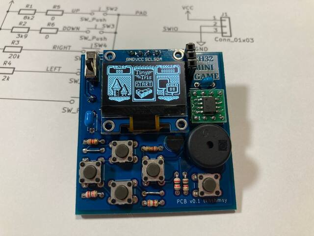
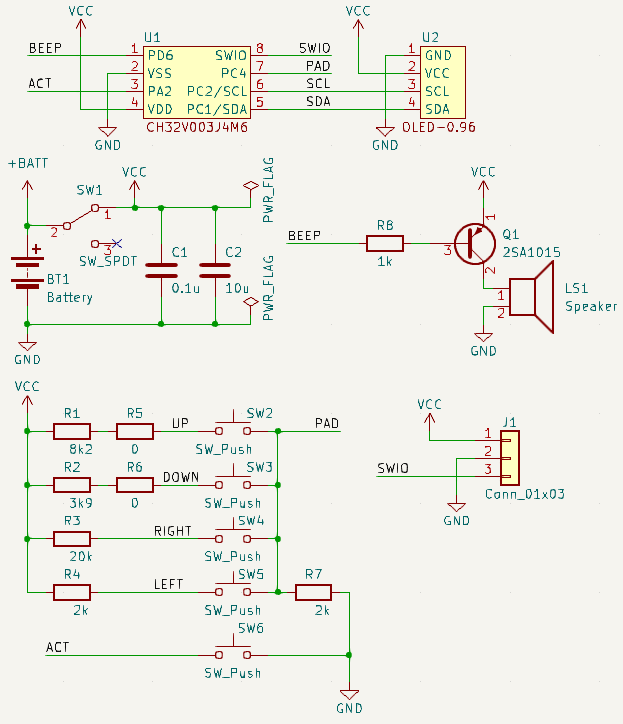
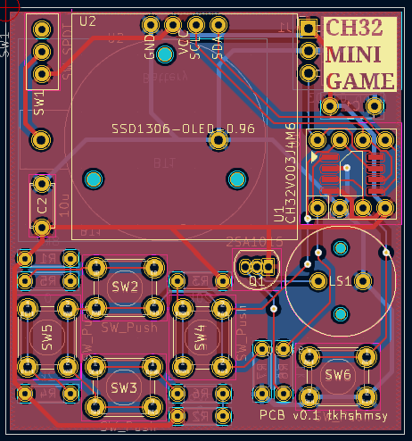

# PCB-ch32-minigameconsole

Private designed PCB for [CH32V003-GameConsole](https://github.com/wagiminator/CH32V003-GameConsole)

## Features
* Size 45 x 48 mm
  * Panelized 4 pcs in 100 x 100mm
* Using THT parts except CH32V003
  * All parts are able to purchase from [Akizuki-Denshi](https://akizukidenshi.com/)



## Schematic and Layout




## BOM
|Ref|Name|Qty|Description|Link|
|---|----|---|-----------|----|
|U1|CH32V003J4M6|1||https://akizukidenshi.com/catalog/g/g118062/|
|U1 ext|SOP8 to DIP8 conversion board|1||https://akizukidenshi.com/catalog/g/g105154|
|U2|OLED 0.96inch|1|128x64 monochrome, i2c|https://akizukidenshi.com/catalog/g/g112031/|
|BT1|CR2032 holder|1||https://akizukidenshi.com/catalog/g/g100706/|
|Q1|2SA1015|1||https://akizukidenshi.com/catalog/g/g117091/|
|LS1|Sounder/Speaker|1||https://akizukidenshi.com/catalog/g/g104118/|
|C1|Capacitor 0.1uF|1||https://akizukidenshi.com/catalog/g/g115927/|
|C2|Capacitor 10uF|1||https://akizukidenshi.com/catalog/g/g103095/|
|R1|Resist 8k2|1||https://akizukidenshi.com/catalog/g/g116822/|
|R2|Resist 3k9|1||https://akizukidenshi.com/catalog/g/g116392/|
|R3|Resist 20k|1|for test build, use 22k|https://akizukidenshi.com/catalog/g/g107842/ or https://akizukidenshi.com/catalog/g/g116223/|
|R4, R7|Resist 2k|2||https://akizukidenshi.com/catalog/g/g116202/|
|R5, R6|Resist 0|2|These are 'Dummy' to create resistance value of R1 / R2 in combination. See 'Other set of resistors'||
|R8|Resist 1k|1|see Errata|https://akizukidenshi.com/catalog/g/g116102/|
|SW1|Slide switch|1||https://akizukidenshi.com/catalog/g/g115707/|
|SW2-6|Push switch|5||https://akizukidenshi.com/catalog/g/g103647/|
|J1|3 pins header/socket|1|SWD port|https://akizukidenshi.com/catalog/g/g115510/ or https://akizukidenshi.com/catalog/g/g110098/|
|--|WCH-LinkE emulator|1|SWD/JTAG tool|https://akizukidenshi.com/catalog/g/g118065/|

### Other set of resistors

|Ref|Set 1(Original)|Set 2|
|---|---------------|-----|
|R1|8k2|4k7|
|R2|3k9|2k2|
|R3|20k|22k|
|R4|2k|2k2|
|R5|0|4k7|
|R6|0|2k2|
|R7|2k|2k2|
|R8|1k|100|

## Errata
* v0.1
  * Sometimes, The LEFT button (SW5) acts as the RIGHT button.
    * It seems to be due to poor analog wiring.
  * Sound too small
    * It seems the limiting resist (R8=1k) is too large.

## How to run
on Linux,

1. Prepare
   1. Get [WCH-LinkE](https://akizukidenshi.com/catalog/g/g118065/)
   2. Download original repository https://github.com/wagiminator/CH32V003-GameConsole
      1. use *.bin files.
   3. Download repository https://github.com/cnlohr/ch32v003fun
      1. use the tool 'minichlink' to write firmware.
2. Write firmware
   1. Build 'minichlink'
   2. Connect WCH-LinkE to PC and PCB with pushing 'ModeS' button.
      1. ref: https://github.com/cnlohr/ch32v003fun/issues/227
      2. to PCB side, connect '3V3, 'GND' and 'SWDIO' to J1.
   3. Write firmware
        ```bash
        ## e.g. tiny-tris
        $ ./minichlink -w CH32V003-GameConsole/software/tiny_tris/tiny_tris.bin flash -b
        ```
3. Enjoy !

## License
Original codes are licensed under Creative Commons.
* Creative Commons Attribution-ShareAlike 3.0 Unported License. (http://creativecommons.org/licenses/by-sa/3.0/)

This PCB project is licensed under same Creative Commons too.


## Author
* tkhshmsy@gmail.com